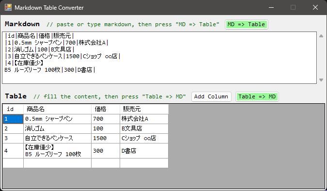
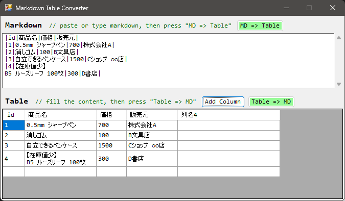
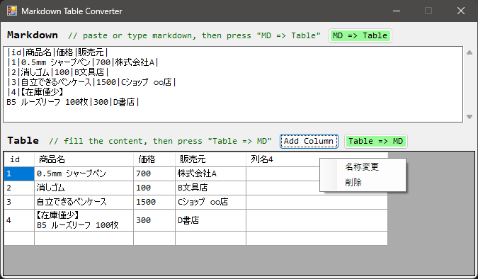

# MarkdownTableConverter

マークダウンで記述された表を、よりグラフィカルに編集できます。

## 動作環境
動作確認済みOS: Windows 11 (10でも動作すると思います、責任は負いません)

## 使い方

### 基本的な使用方法

画面上部で表形式のマークダウンを入力し、「MD => Table」ボタンをクリックすると、
画面下部で実際に表形式に変換します。

逆に、画面下部で内容を編集し、「Table => MD」ボタンをクリックすると、
画面上部でマークダウンで出力します。

### 列追加

列追加する場合は、「Add Column」ボタンを押下することで、表の末尾に新規の列を追加できます。

### 列名変更・列削除・行削除

ヘッダーセルを右クリックすることで、名称変更・列削除を行うことができます。

ヘッダー以外のセルを右クリックすることで、そのセルを含む行を削除することができます。

※現時点だとUndoができないため、削除した情報は元に戻すことができません。

## ライセンス

MIT Licenseのため、個人利用・商用利用不問です。
また、個人で改造し、自分の成果物として再頒布することも可能です。
必要に応じて、ライセンスファイルをご確認ください。